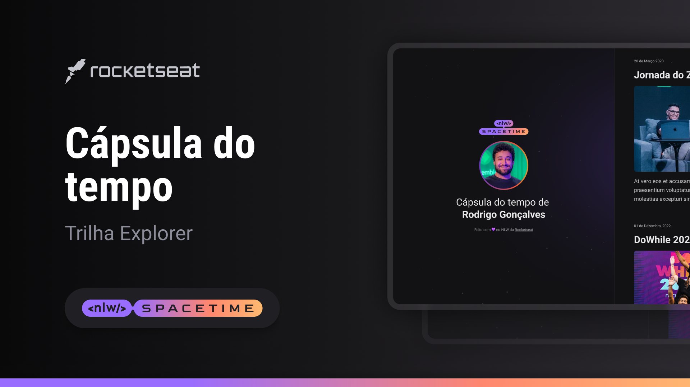

  

## 🖥️ Project

This is a simple example project of a Time Capsule Web Responsive to display memories on a timeline.

## 🚀 Technologies

This project was developed during the Rocketseat's NLW using the following technologies:

- HTML
- CSS
- Git & Github

## 🔖 Layout

You can see the project layout through
[this link](https://www.figma.com/file/xllhBAkuLVflqR1WB9SzTj/Capsula-do-Tempo---Trilha-Explorer?type=design&node-id=306%3A3&t=l2mqywaCaALXnqil-1).
You must have an account at [Figma](https://www.figma.com)
